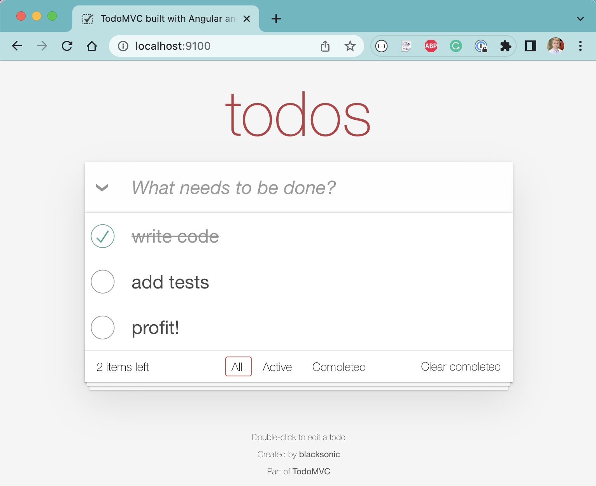
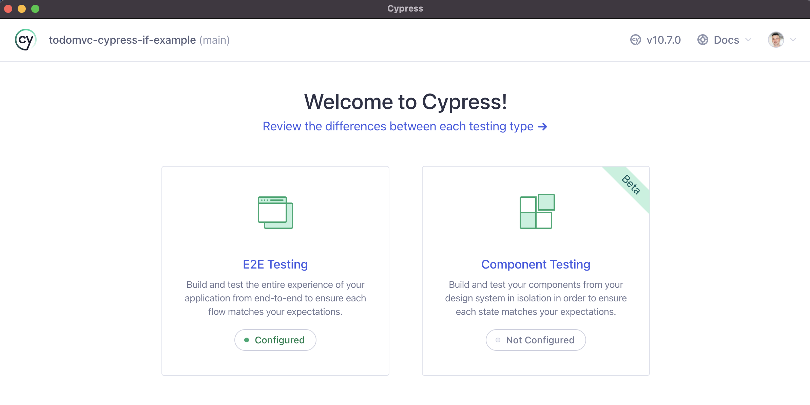

# TodoMVC

> TodoMVC app for practicing conditional test commands using [cypress-if](https://github.com/bahmutov/cypress-if) plugin

Install the NPM dependencies

```
$ npm i
```

Check that the application and the API start

```
$ npm start
$ open localhost:9100
```



Check if Cypress v10 opens

```
$ npx cypress open
```

You should see something like this:



## Small print

This repo was forked from [vuesomedev/todomvc-angular](https://github.com/vuesomedev/todomvc-angular)
